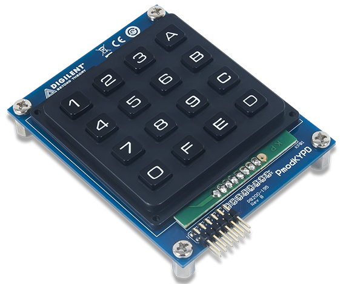
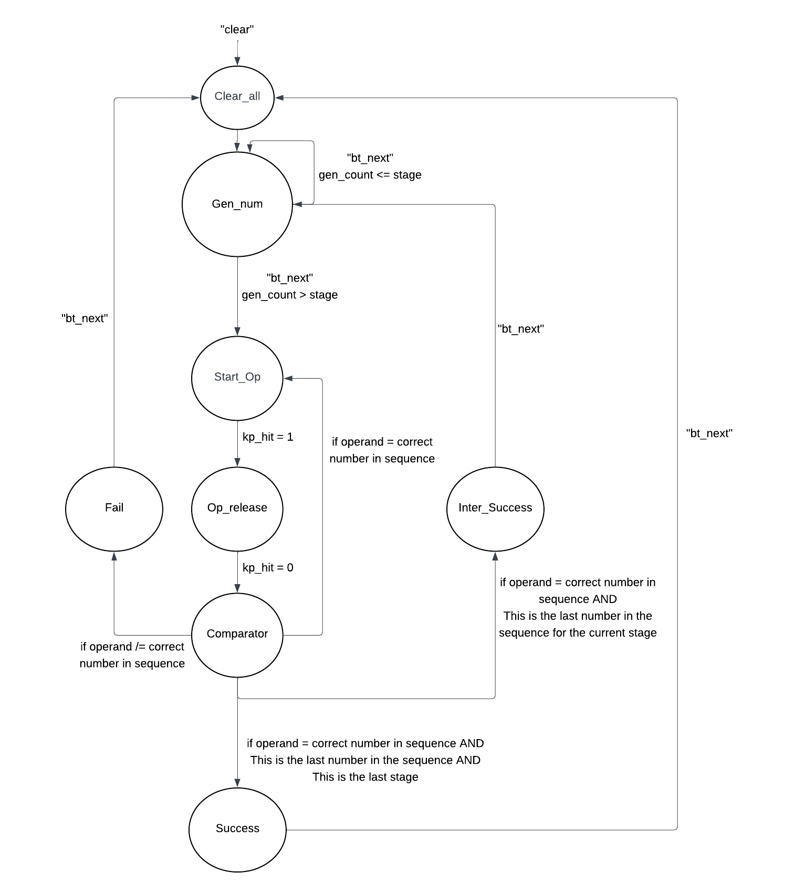

# CPE487 - Simon Says

## Expected behavior of code
* Program the FPGA on the Nexys A7-100T board to function as a Simon Says game using a 16-button keypad module ([Pmod KYPD](https://store.digilentinc.com/pmod-kypd-16-button-keypad/)) connected to the Pmod port JA (See Section 10 of the [Reference Manual](https://reference.digilentinc.com/_media/reference/programmable-logic/nexys-a7/nexys-a7_rm.pdf)) directly or via an optional [2x6-pin cable](https://digilent.com/shop/2x6-pin-pmod-cable/) with three dots (or VDD/GND) facing up on both ends. In the game, the board displays the 1st number of a sequence and the user has to correctly input that number. Then, the board displays the first 2 numbers of the sequence and the user has to input those two numbers. This game continues until either the user loses, by inputting the wrong number, or wins, by inputting the entire 8-digit sequence.

* The top level source module is called **_SimonSays_** that
  * Creates an instance of the keypad interface and 7-segment decoder interface modules
  * Make connection to the display, buttons, and external keypad
  * Has a timing process to generate [clock signals](https://en.wikipedia.org/wiki/Clock_signal) for the keypad, display multiplexer, and [finite-state machine](https://en.wikipedia.org/wiki/Finite-state_machine)
  * Implements a finite-state machine for the operations of the game in response to button pushes

* The finite-state machine uses a number of variables to keep track of which numbers to display whether the user succeeds or fails at the game.
  * The variable _gen_num_ holds the amount of numbers that have been generated for the specific stage.
  * The variable _user_count_ holds the amount of numbers the user has inputted (pressed on the keypad) for the specific stage.
  * The variable _stage_ holds the current stage/level of the game.
  * The variable _display_ holds the value currently being displayed on the 7-segment displays.
  * The variable _pr_state_ is the current state of the finite-state machine.

Depending on the current state, the machine will react to pushed keypad buttons or operation buttons to update variables, change the output, and select the next state.
* Generally, the "bt_next" (BTNU) is used to progress through the states.
* When the clear button is pushed, the machine enters the CLEAR_ALL state.
* In GEN_NUM
  * The sequence of numbers is displayed.
  * This state will loop until it reaches the stage.
  * i.e. First, the stage is 1, so it loops through GEN_NUM once and displays the first number. When the stage is 8, it loops through GEN_NUM 8 times and displays the entire 8-digit sequence.
  * It uses _gen_count_ to know which number to display on the loop. _gen_count_ increases with each loop to allow _Gen_count_ (using the case statement) to display the next number in the sequence.
 * In START_OP
   * This state is copied from lab 4.
   * The machine waits for a keypad button to be pushed.
   * The board displays 'dddd' to signify to the user to press the keypad.
* In OP_RELEASE
  * This state is very similar to the one from lab 4.
  * The board displays the button currently pressed on the keypad and waits for the button to release to go to the comparator state.
* In COMPARATOR
  * This state determines whether it is a success for the stage, a failure, or more numbers need to be pressed.
  * When the correct number is pressed, the machine checks if user_count  = stage+1 to determine if it is at the end of the sequence for the current stage. This is because _user_count_ is incremented in START_OP but _stage_ is incremented in INTER_SUCCESS, so _user_count_ needs to be one more than _stage_.
  * If the wrong number is pressed, it is a failure and the next state is FAIL.
* In INTER_SUCCESS
  * The board displays '0AA0' to signify a success.
  * The game then continues (after BTNU is pressed) and the next sequence is shown.
* In SUCCESS
  * This state is the end of the game. The board displays 'AAAA' to signify to the user that they received an A+ for the game :)
  * The user can restart the game by pressing "bt_next" (BTNU) or clear (BTNC).
* In FAIL
  * This state is the end of the game when the user fails. The board displays 'FFFF' to signal to the user that they received an F grade :(
  * The user can restart the game by pressing BTNU or BTNC.

## Steps to get project to work

### 1. Create a new RTL project _hexcalc_ in Vivado Quick Start

* Create three new source files of file type VHDL called **_keypad_**, **_leddec16_**, and **_SimonSays_**

* Create a new constraint file of file type XDC called **_SimonSays_**

* Choose Nexys A7-100T board for the project

* Click 'Finish'

* Click design sources and copy the VHDL code from keypad.vhd, leddec16.vhd, and SimonSays.vhd

* Click constraints and copy the code from SimonSays.xdc

* As an alternative, you can instead download files from Github and import them into your project when creating the project. The source file or files would still be imported during the Source step, and the constraint file or files would still be imported during the Constraints step.

### 2. Run synthesis

### 3. Run implementation

### 3b. (optional, generally not recommended as it is difficult to extract information from and can cause Vivado shutdown) Open implemented design

### 4. Generate bitstream, open hardware manager, and program device

* Click 'Generate Bitstream'

* Click 'Open Hardware Manager' and click 'Open Target' then 'Auto Connect'

* Click 'Program Device' then xc7a100t_0 to download hexcalc.bit to the Nexys A7-100T board

### 5. Use keypad and buttons
* Press BTNU to continuously advance through the game.
* Watch the Nexys A7-100T board which will display a sequence of numbers.
* When the left side of the board displays ‘dddd’, it is time for you to use the keypad.
* Use the keypad to press the number(s) that was just displayed in order. If you correctly do so, then the Nexys A7-100T board will display ‘0AA0’ meaning success. Press "bt_next" (BTNU) to continue playing the game and have the board continue displaying numbers that you will need to input on the keypad.
* When the board displays ‘AAAA’, you have reached the end of the game and won.
* If the board displays ‘FFFF’, you have reached the end of the game and lost.
* Press "clear" (BTNC) to restart the game.

## Inputs and Outputs

## Modifications
See IntermediaryCodes for detailed steps on how we created the code

## Process

Chris: Button press, gen_num, multiple levels, inter-success

Abigail: Button else statements, Comparator

Both: Clearing, Success, Failure

